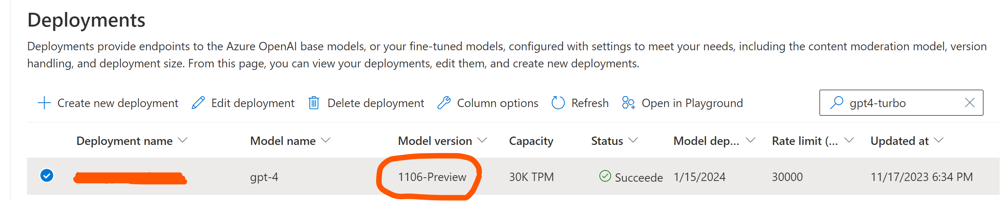

# Reproducible output with Azure OpenAI GPT-4-Turbo v1106
Generating reproducible output in GPT-4-Turbo with the "seed" parameter in Python SDK v1.x. This feature was originally announced by OpenAI during their Dev Day on 6th of November, and is available in Azure OpenAI from 17th of November.

To use the latest version of openai python packahe, you can upgrade it wth the following pip command:
```
pip install --upgrade openai
```

## Table of contents:
- [Pre-requisites]()
- [Option 1: Testing without seed]()
- [Option 2: Testing with seed]()
- [Verifying reproducible outcome]()

## Pre-requisites
1. Ensure that you deploy GPT model of v1106, either GPT-4-Turbo or GPT-35-Turbo.

2. Set API endpoint name, version and key, along with the Azure OpenAI deployment name to the relevant environment variables. Provided code assumes that environment variables are **OPENAI_API_BASE**, **OPENAI_API_VERSION**, **OPENAI_API_KEY** and **OPENAI_API_DEPLOY**.

3. To "almost always" reproduce the same output, your **seed" parameter should be set to the same integer value. In this example, it's set to 42.
4. All the other parameters (like "temperature", "messages", etc.) in the Chat Completions API call should also stay the same.

## Option 1: Testing without seed

## Option 2: Testing with seed

## Verifying reproducible outcome
